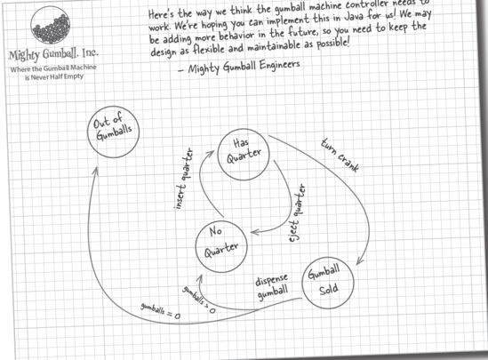
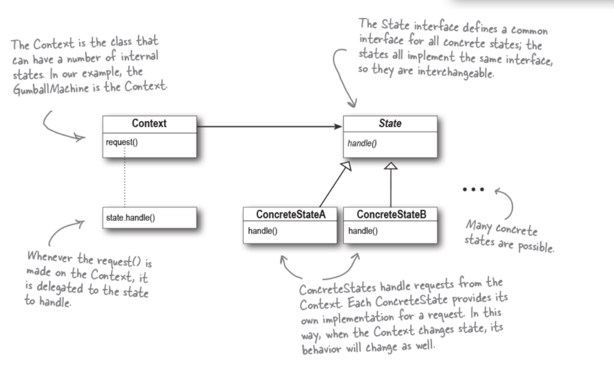

# State Pattern
The State Pattern allows an object to alter its behavior when its internal state changes. The object will appear to change its class.

### Notes
CodeEg: GumballMachine with it various states (has coin, has no coin, gumball sold, soldout) and actions(coin inserted, coin ejected, trunk turned) is usedto understand State pattern

### **BULLET POINTS**

- The State Pattern allows an object to have many different behaviors that are based on its internal state.

- Unlike a procedural state machine, the State Pattern represents each state as a full-blown class.

- The Context gets its behavior by delegating to the current state object it is composed with.

- By encapsulating each state into a class, we localize any changes that will need to be made.

- The State and Strategy Patterns have the same class diagram, but they differ in intent.

- The Strategy Pattern typically configures Context classes with a behavior or algorithm.

- The State Pattern allows a Context to change its behavior as the state of the Context changes.

- State transitions can be controlled by the State classes or by the Context classes.

- Using the State Pattern will typically result in a greater number of classes in your design.

- State classes may be shared among Context instances.

