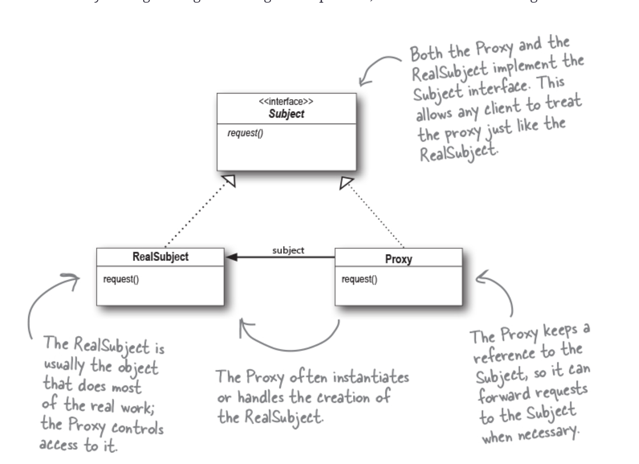
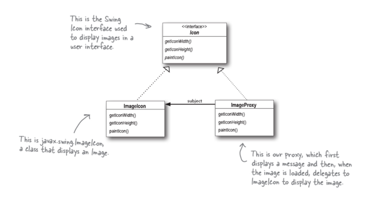
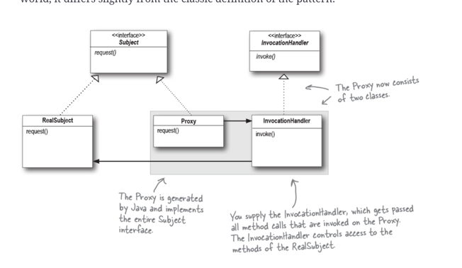

# State Pattern
The Proxy Pattern provides a surrogate or placeholder for another object to control access to it.

### Notes
CodeEg: I have not added typescript implementation for this pattern, since the example implementations
in book where mostly tied to Java language features (Remote proxy -Java RMI, Virtual Proxy- Java multithreading, Protection Proxy- java Reflection)

Use the Proxy Pattern to create a representative object that controls access to another object, which may be remote, expensive to create, or in need of securing.

- A remote proxy controls access to a remote object.

- A virtual proxy controls access to a resource that is expensive to create.

- A protection proxy controls access to a resource based on access rights.

### **BULLET POINTS**

The Proxy Pattern provides a representative for another object in order to control the client’s access to it. There are a number of ways it can manage that access.

- A Remote Proxy manages interaction between a client and a remote object.

- A Virtual Proxy controls access to an object that is expensive to instantiate.

- A Protection Proxy controls access to the methods of an object based on the caller.

- Many other variants of the Proxy Pattern exist including caching proxies, synchronization proxies, firewall proxies, copy-on-write proxies, and so on.

- Proxy is structurally similar to Decorator, but the two patterns differ in their purpose.

- The Decorator Pattern adds behavior to an object, while Proxy controls access.

- Java’s built-in support for Proxy can build a dynamic proxy class on demand and dispatch all calls on it to a handler of your choosing.

- Like any wrapper, proxies will increase the number of classes and objects in your designs.

