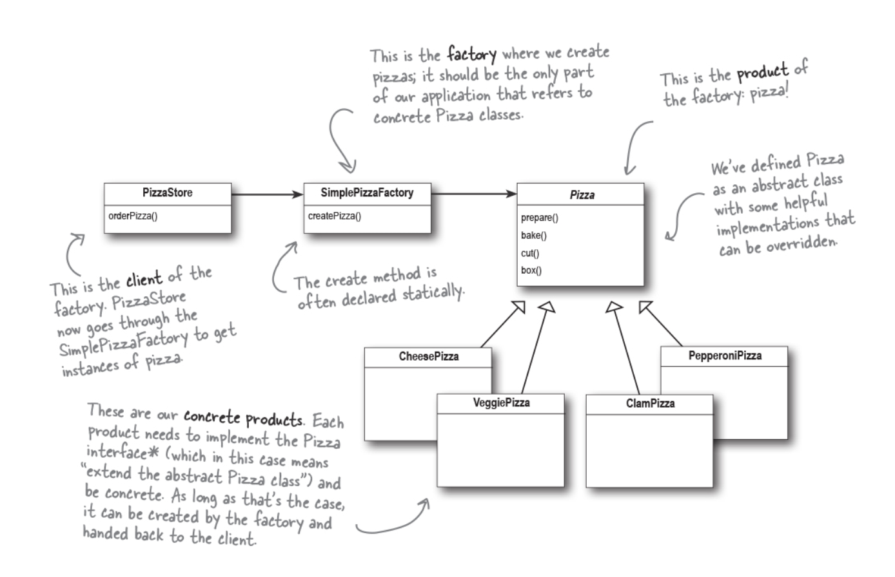
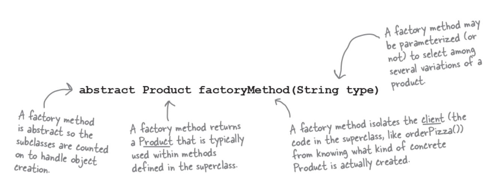
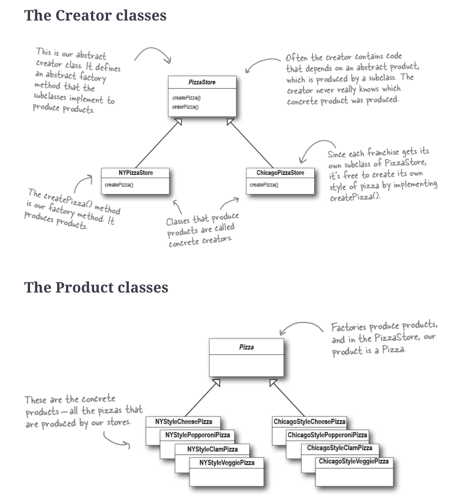
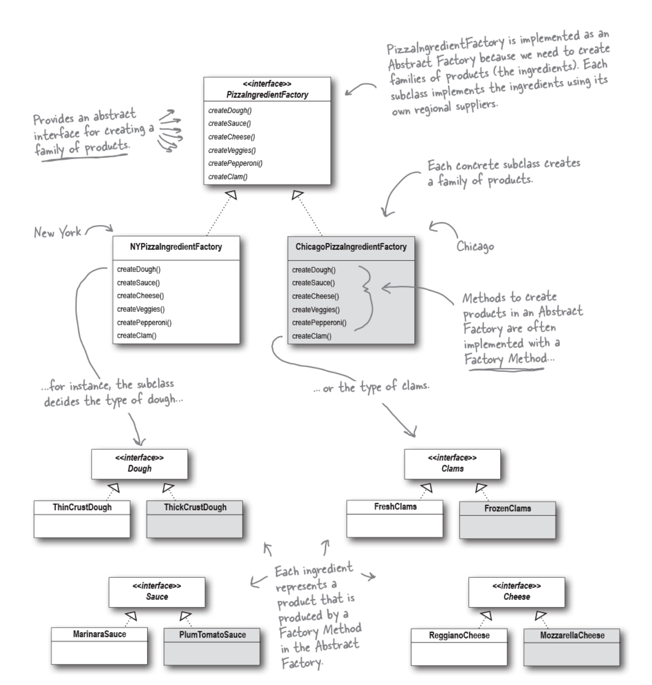

# Factory Pattern

This chapter is covered in 3 sections.
* Simple Factory(isn’t actually a Design Pattern. It’s more of a programming idiom)
* Factory method
* Abstract factory

## Learnings from this chapter:
### OO Principles:
* Depend upon abstraction. Do not depend upon concrete classes

### Notes
- Instantiation is an activity that shouldn’t always be done in public and can often lead to *coupling problems*
- **When you see “new,” think “concrete.→** when you use the **new** operator you are certainly instantiating a concrete class, so that’s definitely an implementation and not an interface. when it comes time for changes or extensions, you’ll have to reopen this code and examine what needs to be added (or deleted).
- By coding to an interface, you know you can insulate yourself from many of the changes that might happen to a system down the road. When you have code that makes use of lots of concrete classes, you’re looking for trouble because that code may have to be changed as new concrete classes are added. Your code will not be “closed for modification.”
- Take all the parts of your application that instantiate concrete classes and separate or encapsulate them from the rest of your application

### Simple Factory
- Factories handle the details of object creation
- The Simple Factory isn’t actually a Design Pattern; it’s more of a programming idiom.

##### Code details:
 

### Factory method
**The Factory Method Pattern defines an interface (also includes abstraction) for creating an object, but lets subclasses decide which class to instantiate. Factory Method lets a class defer instantiation to subclasses.**
- A factory method handles object creation and encapsulates it in a subclass. This decouples the client code in the superclass from the object creation code in the subclass.
- All factory patterns encapsulate object creation. The Factory Method Pattern encapsulates object creation by letting subclasses decide what objects to create

##### Code details:

####Dependency Inversion Principle: ####
- Reducing dependencies to concrete classes in our code.
- Factory Method is not the only technique for adhering to the Dependency Inversion Principle, but it is one of the more powerful ones.
- High-level components should not depend on our low-level components; rather, they should both depend on abstractions. This is dependency inevrsion
- eg: PizzaStore is a high-level component because its behavior is defined in terms of pizzas — it creates all the different pizza objects, and prepares, bakes, cuts, and boxes them, while the pizzas it uses are low-level components. Pizza is an abstract class on which PizzaStore and Pizzas depend.

A few guidelines to help you follow the **Dependency Inversion** Principle:
- No variable should hold a reference to a concrete class
    - If you use **new**, you’ll be holding a reference to a concrete class. Use a factory to get around that!
- No class should derive from a concrete class
    - If you derive from a concrete class, you’re depending on a concrete class. Derive from an abstraction, like an interface or an abstract class.

This is a guideline you should strive for, rather than a rule you should follow all the time. Clearly, every single Java program ever written violates these guidelines!

### Abstract factory
**The Abstract Factory Pattern provides an interface for creating families of related or dependent objects without specifying their concrete classes.**
- From the abstract factory, we derive one or more concrete factories that produce the same products, but with different implementations
- Often the methods of an Abstract Factory are implemented as factory methods.  The job of an Abstract Factory is to define an interface for creating a set of products.

##### code details:

### How to run
* npm install
* npm start