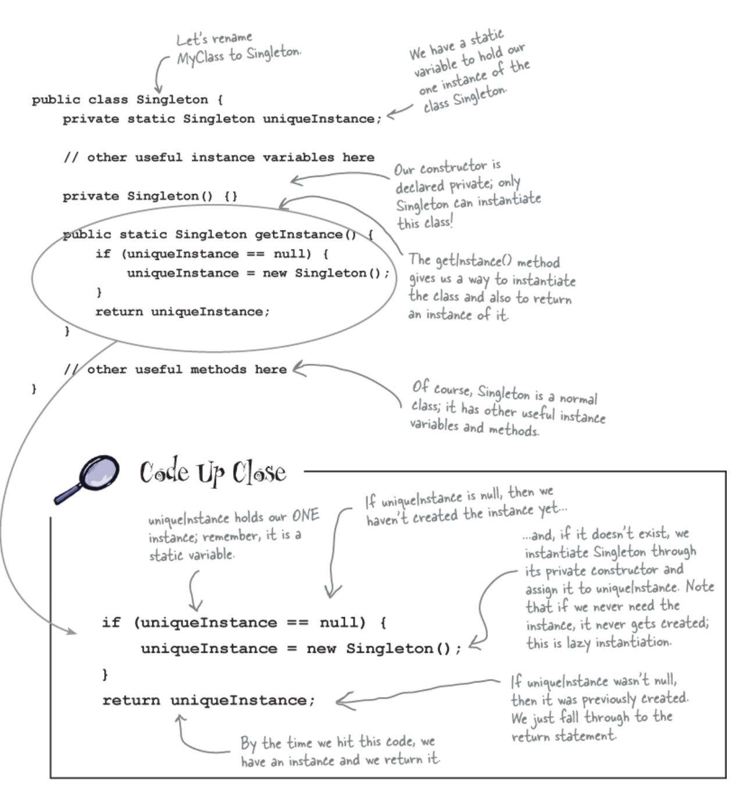

# Singleton Pattern
The Singleton Pattern ensures a class has only one instance, and provides a global point of access to it.

## Learnings from this chapter:
Dissecting the classic Singleton Pattern implementation:

### Notes
- Singleton can be created in a lazy manner, which is especially important for resource-intensive objects (unilike global variables)
- Dealing with multithreading: it’s expensive to synchronize the getInstance() method, so what do we do?
    1. Do nothing if the performance of getInstance() isn’t critical to your application
        - Synchronizing a method can decrease performance by a factor of 100, so if a high-traffic part of your code begins using getInstance(), you may have to reconsider.
    2. Move to an eagerly created instance rather than a lazily created one.
    3. Use “double-checked locking” to reduce the use of synchronization in getInstance().
- Can’t I just create a class in which all methods and variables are defined as static? Wouldn’t that be the same as a Singleton? → Yes, if your class is self-contained and doesn’t depend on complex initialization
- Every object in our code that depends on the Singleton is going to be tightly coupled to that very specific object. Common criticism of the Singleton Pattern. If you make a change to the Singleton, you’ll likely have to make a change to every object connected to it.
- Subclassing singleton? → problem with subclassing a Singleton is that the constructor is private. You can’t extend a class with a private constructor
- If you are using a large number of Singletons in your application, you should take a hard look at your design. Singletons are meant to be used sparingly.
- Global variables are worse than a Singleton→ The issue of lazy versus eager instantiation

### **BULLET POINTS (Copied from book)**

- The Singleton Pattern ensures you have at most one instance of a class in your application.
- The Singleton Pattern also provides a global access point to that instance.
- Java’s implementation of the Singleton Pattern makes use of a private constructor, a static method combined with a static variable.
- Examine your performance and resource constraints and carefully choose an appropriate Singleton implementation for multithreaded applications (and we should consider all applications multithreaded!).
- Beware of the double-checked locking implementation; it isn’t thread safe in versions before Java 5.
- Be careful if you are using multiple class loaders; this could defeat the Singleton implementation and result in multiple instances.
- You can use Java’s enums to simplify your Singleton implementation.

### code details
- ChocolateBoiler.ts -> singleton class

### How to run
- npm install
- npm start
