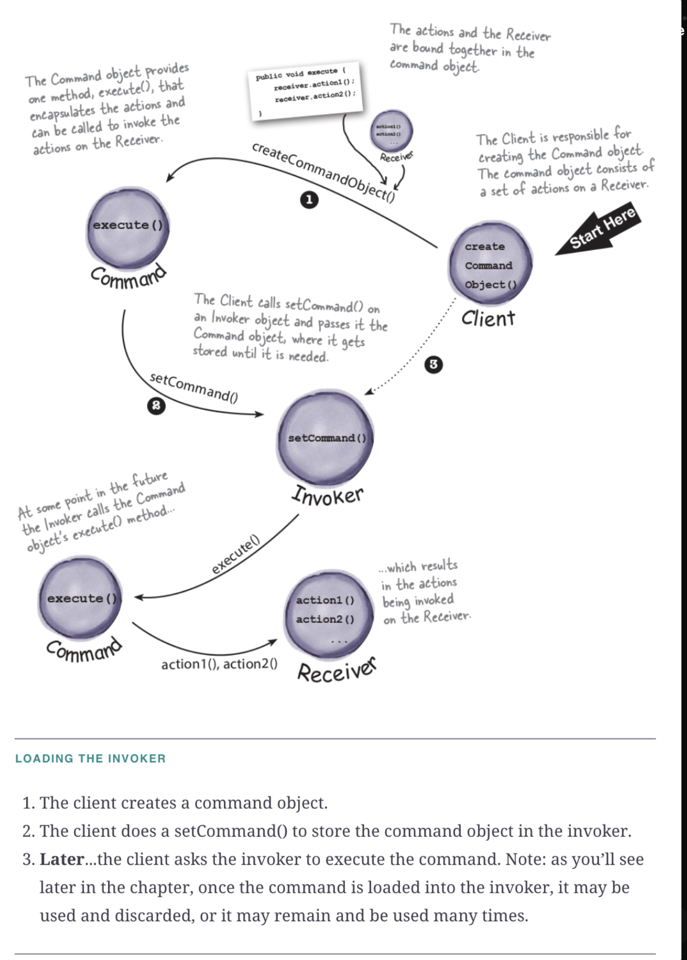

# Command Pattern
**The Command Pattern encapsulates a request as an object, thereby letting you parameterize other objects with different requests, queue or log requests, and support undoable operations.**

### Problem Scenario
- Design a Remote control with following requirements
    - on & off button for each device
    - global undo button to undo last action
    - constraint: Devices can have methods with any name (no need to be on() or off() always)
- Its difficult for remote to remember what needs to be mapped to on() & of() for each device. Using case statement is not suggested since addition of device or change in device method would enforce us to change in Remote class.
- Solution → use Command pattern, where command object encapsulated the request (to execute action on device) as an object, and Remote need not know what is command at all.

### Notes
- The Command Pattern allows you to decouple the requester of an action from the object that actually performs the action
- The requester would be the remote control and the object that performs the action would be an instance of one of your vendor classes.
- A command object encapsulates a request to do something (like turn on a light) on a specific object (say, the living room light object).

### **BULLET POINTS** (Copied from book)

- The Command Pattern decouples an object making a request from the one that knows how to perform it.
- A Command object is at the center of this decoupling and encapsulates a receiver with an action (or set of actions).
- An invoker makes a request of a Command object by calling its execute() method, which invokes those actions on the receiver.
- Invokers can be parameterized with Commands, even dynamically at runtime.
- Commands may support undo by implementing an undo() method that restores the object to its previous state before the execute() method was last called.
- MacroCommands are a simple extension of the Command Pattern that allow multiple commands to be invoked. Likewise, MacroCommands can easily support undo().
- In practice, it’s not uncommon for “smart” Command objects to implement the request themselves rather than delegating to a receiver.
- Commands may also be used to implement logging and transactional systems

###Code Details
- RemoteControl class is Invoker, which will take Command object as parameter.
- Command object have actual device action to be permored in its execute() method.
- RemoteControl is unaware for what device its performing action. So Invoker & receiver are totally decoupled.
- On pressed button, RemoteControl just invokes execute() method of Command object it received (totally unaware for which receiver(device) its performing action)