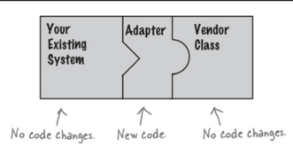
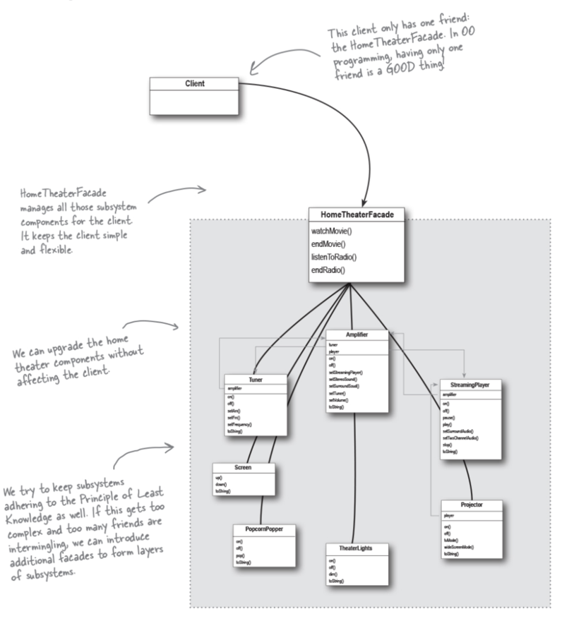

# Adaptive and Facade Pattern

## Learnings from this chapter:
**The Adapter Pattern converts the interface of a class into another interface the clients expect. Adapter lets classes work together that couldn’t otherwise because of incompatible interfaces.**

### Notes
- Take eg of Power adaper. The adapter changes the interface of the outlet into one that your laptop expects.
- Similarly OO adapters play the same role as their real-world counterparts: they take an interface and adapt it to one that a client is expecting.

- Code Eg: We have ducks & Turkeys. But because of shortage of Ducks for client, we want turkey behave like Duck
- we could use several adapters, each converting a different backend set of classes.

**The Facade Pattern provides a unified interface to a set of interfaces in a subsystem. Facade defines a higher-level interface that makes the subsystem easier to use.**

### OO Principles:
* Principle of Least Knowledge, talk only to your immediate friends

### Notes
- Facade- word meaning : A deceptive outward appearance.
- Pattern that alters an interface,  to simplify the interface.
- Facades don’t “encapsulate” the subsystem classes; they merely provide a simplified interface to their functionality. The subsystem classes still remain available for direct use by clients that need to use more specific interfaces.
- A facade is free to add its own “smarts” in addition to making use of the subsystem
- Facade is fairly straightforward; there are no mind-bending abstractions to get your head around. But that doesn’t make it any less powerful: the Facade Pattern allows us to avoid tight coupling between clients and subsystems,
- Facades and adapters may wrap multiple classes, but a facade’s intent is to simplify, while an adapter’s is to convert the interface to something different.
- Code eg:
  - If a client wants to watch movie in hometheater, he needs to deal with classes like Amplifier, Projector, TheatherLights, Tuner, Screen TheatreLights, PopcornPopper etc etc. Even while turning off, client would have to teal with all these
  - Instead we can have a class called HomeTheaterFacade where we use all above classes as composition, and have simpler on() & off() methods that deals with all classes making it easir to client.
  - class diagram:

    
    
    It means when you are designing a system, for any object, be careful of the number of classes it interacts with and also how it comes to interact with those classes.

    This principle prevents us from creating designs that have a large number of classes coupled together so that changes in one part of the system cascade to other parts. When you build a lot of dependencies between many classes, you are building a fragile system that will be costly to maintain and complex for others to understand.

    ### **BULLET POINTS**

  - When you need to use an existing class and its interface is not the one you need, use an adapter.
  - When you need to simplify and unify a large interface or complex set of interfaces, use a facade.
  - An adapter changes an interface into one a client expects.
  - A facade decouples a client from a complex subsystem.
  - Implementing an adapter may require little work or a great deal of work depending on the size and complexity of the target interface.
  - Implementing a facade requires that we compose the facade with its subsystem and use delegation to perform the work of the facade.
  - There are two forms of the Adapter Pattern: object and class adapters. Class adapters require multiple inheritance.
  - You can implement more than one facade for a subsystem.
  - An adapter wraps an object to change its interface, a decorator wraps an object to add new behaviors and responsibilities, and a facade “wraps” a set of objects to simplify.