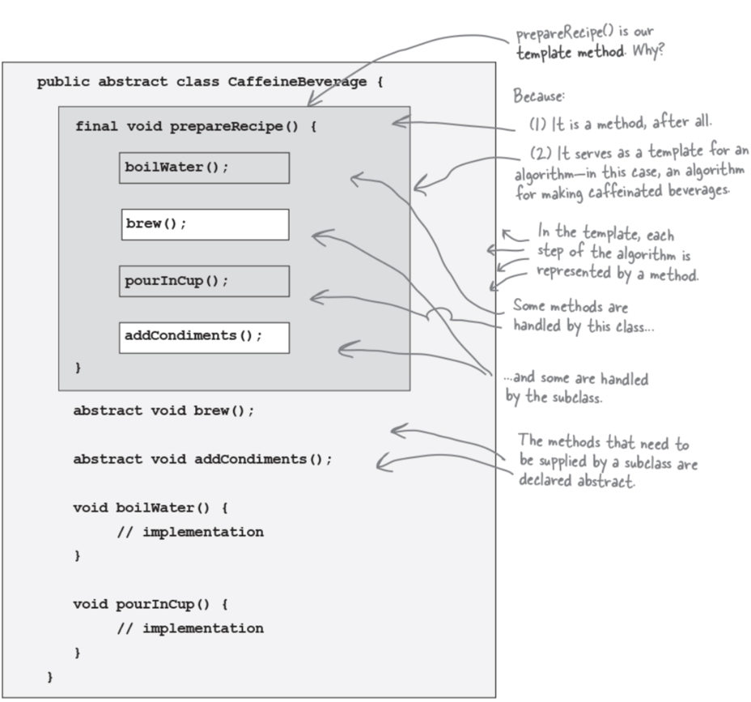
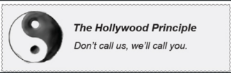

# Template Pattern
The Template Method Pattern defines the skeleton of an algorithm in a method, deferring some steps to subclasses. Template Method lets subclasses redefine certain steps of an algorithm without changing the algorithm’s structure.

### Notes
CodeEg: Preparing tea & cofee have few same steps. Though few steps are different, the pattern/algoritnm is same. So implement common methods in abstract class to prevent duplication, and  uncommon steps in subclasses. But since pattern is same, implement prepareRecipe() method in abstarct class, and make it **final** so that subclasses cannot deviate from pattern. Since this method defined template algorithm, it template method.

- A hook is a method that is declared in the abstract class, but only given an empty or default implementation. This gives subclasses the ability to “hook into” the algorithm at various points, if they wish; a subclass is also free to ignore the hook
- Use abstract methods when your subclass MUST provide an implementation of the method or step in the algorithm. Use hooks when that part of the algorithm is optional. With hooks, a subclass may choose to implement that hook, but it doesn’t have to

Principle gives us a way to prevent “dependency rot.” Dependency rot happens when you have high-level components depending on low-level components depending on high-level components depending on sideways components depending on low-level components, and so on. When rot sets in, no one can easily understand the way a system is designed.

With this Principle, we allow low-level components to hook themselves into a system, but the high-level components determine when they are needed, and how. In other words, the high-level components give the low-level components the “don’t call us, we’ll call you” treatment.

### **BULLET POINTS**

- A template method defines the steps of an algorithm, deferring to subclasses for the implementation of those steps.
- The Template Method Pattern gives us an important technique for code reuse.
- The template method’s abstract class may define concrete methods, abstract methods, and hooks.
- Abstract methods are implemented by subclasses.
- Hooks are methods that do nothing or default behavior in the abstract class, but may be overridden in the subclass.
- To prevent subclasses from changing the algorithm in the template method, declare the template method as final.
- The Hollywood Principle guides us to put decision making in high-level modules that can decide how and when to call low-level modules.
- You’ll see lots of uses of the Template Method Pattern in real-world code, but (as with any pattern) don’t expect it all to be designed “by the book.”
- The Strategy and Template Method Patterns both encapsulate algorithms, the first by composition and the other by inheritance.
- Factory Method is a specialization of Template Method.