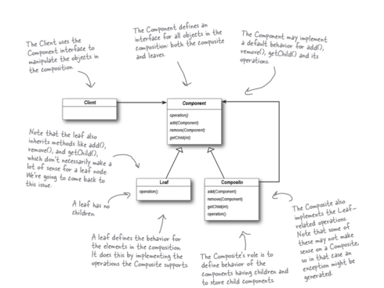

#Iterator and Composite Pattern

## Iterator Pattern
**The Iterator Pattern provides a way to access the elements of an aggregate object sequentially without exposing its underlying representation.**

## Learnings from this chapter:
### OO Principles:
 * A class should have only one reason to change (Single Responsibility Principle)

###Notes
- Aggregate object in defination means → collection (array, asrraylist, Hashmap etc)
- The pattern gives you a way to step through the elements of an aggregate without having to know how things are represented under the covers (array, asrraylist, Hashmap etc)
- Other important impact on your design is that the Iterator Pattern takes the responsibility of traversing elements and gives that responsibility to the iterator object, not the aggregate object. This not only keeps the aggregate interface and implementation simpler, it removes the responsibility for iteration from the aggregate and keeps the aggregate focused on the things it should be focused on (managing a collection of objects), not on iteration
- Eg Code: 
  - There are two restaurants PanCakeHouse & DinnerHouse which got merged recently. Now waitress has to get menu list from both restaurants. Problem is, PanCakeHouse return menulist is SET & DinnerHouse return menulist in ARRAY. So now waitress need to iterate over both menus in two ways, this would increase code complexity if more restaurants gets merged.
  - This problem can be solved if restaurants has logic to convert theit menuList collection(Array, Set etc) to iterator object (makes iteration easy for waitress) and returns it. This would decrease complexity at waitress side, and also waitress need not no type of Collection implemented in restaurants. Most of the languages have iterator interable interface or datatype(even javascript). In our example we will build our own iteration interface (next(), hasNext()). 
  - But adding iterator logic in same restaurant class makes class responsibilities of two things. Taking care of its own business & managing iteration. This does not follow Single Responsibility Principle. So have logic to generate iterator object in separate class.

- The Single Responsibility Principle - A class should have only one reason to change
    - We know we want to avoid change in our classes because modifying code provides all sorts of opportunities for problems to creep in. Having two ways to change increases the probability the class will change in the future, and when it does, it’s going to affect two aspects of your design.
    - Need to recognize that when we allow a class to not only take care of its own business (managing some kind of aggregate) but also take on more responsibilities (like iteration) then we’ve given the class two reasons to change.

## Composite Pattern
**The Composite Pattern allows you to compose objects into tree structures to represent part-whole hierarchies. Composite lets clients treat individual objects and compositions of objects uniformly.**

###Notes
- 
- The Composite Pattern allows us to build structures of objects in the form of trees that contain both compositions of objects and individual objects as nodes.
- Using a composite structure, we can apply the same operations over both composites and individual objects. In other words, in most cases we can ignore the differences between compositions of objects and individual objects.
- 

BULLET POINTS: (Copied from text book)
- An Iterator allows access to an aggregate’s elements without exposing its internal structure.
- An Iterator takes the job of iterating over an aggregate and encapsulates it in another object.
- When using an Iterator, we relieve the aggregate of the responsibility of supporting operations for traversing its data.
- An Iterator provides a common interface for traversing the items of an aggregate, allowing you to use polymorphism when writing code that makes use of the items of the aggregate.
- The Iterable interface provides a means of getting an iterator and enables Java’s enchanced for loop.
- We should strive to assign only one responsibility to each class.
- The Composite Pattern allows clients to treat composites and individual objects uniformly.
- A Component is any object in a Composite structure. Components may be other composites or leaves.
- There are many design tradeoffs in implementing Composite. You need to balance transparency and safety with your needs.